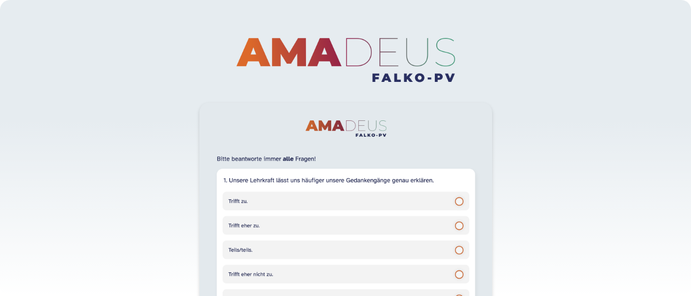

# Unterrichtsevaluation mit AMADEUS – zuverlässig, datenschutzkonform und kostenlos



## Installation

### Docker 

### Manual

1. Create a [Virtual Environment](https://docs.python.org/3/library/venv.html) or a [Conda Environment](https://conda.io/projects/conda/en/latest/user-guide/install/index.html)

2. Install Requirements

```shell
pip install -r requirements.txt
```

3. Specify the following environment variables

```shell
# Can be created by $ openssl rand -base64 32
# Will be used for hashing
SECRET_KEY = "..."

# Add E-Mail Host
AMADEUS_EMAIL_HOST='smtp.hostingservice.de'
AMADEUS_EMAIL_HOST_USER='yourhostmail@mail.com'
AMADEUS_EMAIL_HOST_PASSWORD='yourpassword'
WEBSITE_URL = 'http://yourwebsite.com/' # production url
```

4. Run App

```shell
python manage.py runserver
```

## Further Recommendations / Tipps / Tricks

### Run App in LAN

1. Add additional IP-Adress to ALLOWED_HOSTS in settings.py
2. `python manage.py runserver <IP-Adress>:<PORT>` (For example: `python manage.py runserver 192.168.178.87:8080`)

### Apply Database Changes

Apply Migrations
`python manage.py makemigrations`

Add Migrations
`python manage.py migrate`
